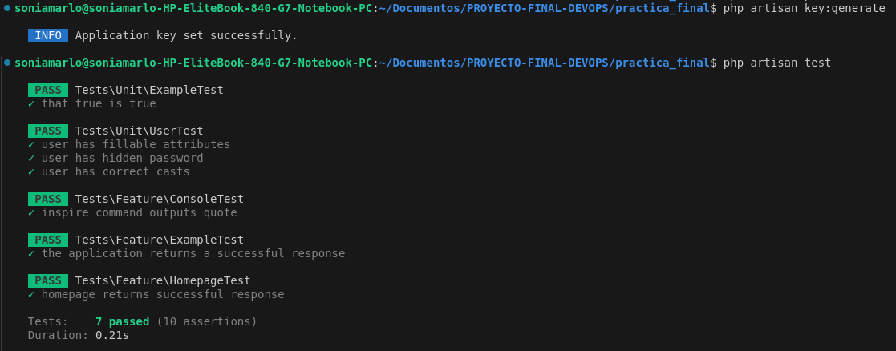
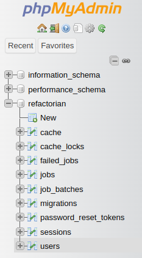
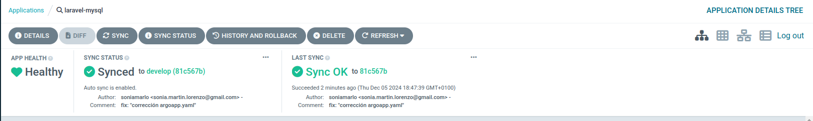
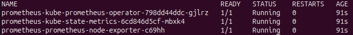
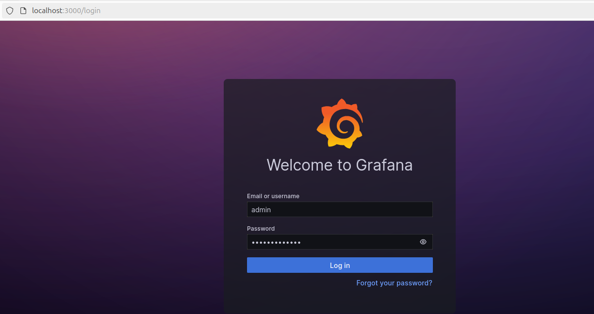
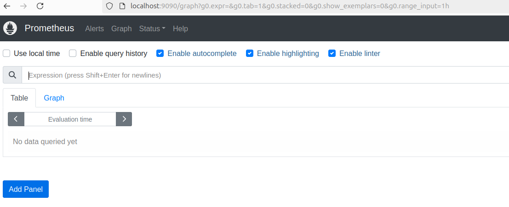

<p align="center"><a href="https://laravel.com" target="_blank"></a></p>


# README.md modificado
### Pasos a seguir para realizar los test
1. composer install
2. .cp .env.example .env
3. php artisan key:generate
4. php artisan test



### Pasos a seguir para migrar tablas a database refactorian

- `docker compose up -d --build`
- `docker compose exec phpmyadmin chmod 777 /sessions`
- `docker compose exec php bash`
- `chown -R www-data:www-data /var/www/storage /var/www/bootstrap/cache`
- `chmod -R 775 /var/www/storage /var/www/bootstrap/cache`
- `composer setup`
- `composer install`
- `php artisan key:generate`
- `php artisan migrate`




### Pasos a seguir para ArgoCD

1. Si ArgoCD no está instalado en tu clúster de Kubernetes, instálalo ejecutando:

```bash
kubectl apply -n argocd -f https://raw.githubusercontent.com/argoproj/argo-cd/stable/manifests/install.yaml
```
2. Iniciar minikube
```bash
minikube start
```

3. Crear el namespace de ArgoCD si no existe
```bash
kubectl create namespace argocd
```
4. Exponer el servidor de ArgoCD
Para acceder a la interfaz web de ArgoCD, realiza un port-forward al servicio del servidor de ArgoCD:
```bash
kubectl port-forward svc/argocd-server -n argocd 8080:443
```
Accede a la interfaz en https://localhost:8080.

5. Obtener las credenciales de acceso:
El usuario por defecto de ArgoCD es admin. Para obtener la contraseña, ejecuta el siguiente comando:
```bash
kubectl get secret argocd-initial-admin-secret -n argocd -o jsonpath="{.data.password}" | base64 -d
```
Copia la contraseña generada e inicia sesión en la interfaz web.

6. Crear la aplicación en ArgoCd

Aplica el archivo argoapp.yaml para registrar y desplegar la aplicación en ArgoCD:
```bash
kubectl apply -f practica_final/charts/argocd/argoapp.yaml
```




# Laravel Docker Starter Kit
- Laravel v11.x
- PHP v8.3.x
- MySQL v8.1.x (default)
- MariaDB v10.11.x
- PostgreSQL v16.x
- pgAdmin v4.x
- phpMyAdmin v5.x
- Mailpit v1.x
- Node.js v18.x
- NPM v10.x
- Yarn v1.x
- Vite v5.x
- Rector v1.x
- Redis v7.2.x

# Requirements
- Stable version of [Docker](https://docs.docker.com/engine/install/)
- Compatible version of [Docker Compose](https://docs.docker.com/compose/install/#install-compose)

# How To Deploy

### For first time only !
- `git clone https://github.com/refactorian/laravel-docker.git`
- `cd laravel-docker`
- `docker compose up -d --build`
- `docker compose exec phpmyadmin chmod 777 /sessions`
- `docker compose exec php bash`
- `chown -R www-data:www-data /var/www/storage /var/www/bootstrap/cache`
- `chmod -R 775 /var/www/storage /var/www/bootstrap/cache`
- `composer setup`

### From the second time onwards
- `docker compose up -d`

### Despliegue de Prometheus y Grafana
Para desplegar los ficheros en Prometheus se debe seguir los siguientes pasos:
- Crear un cluster de Kubernetes:  

    ```sh
    minikube start --kubernetes-version='v1.28.3' \
        --cpus=4 \
        --memory=4096 \
        --addons="metrics-server,default-storageclass,storage-provisioner" \
        -p practica-final
    ```  
    
- Añadir el repositorio de helm `prometheus-community` para poder desplegar el chart `kube-prometheus-stack`:

    ```sh
    helm repo add prometheus-community https://prometheus-community.github.io/helm-charts
    helm repo update
    ```  
 - Desplegar el chart `kube-prometheus-stack` del repositorio de helm añadido en el paso anterior con los valores configurados en el archivo `kube-prometheus-stack/values.yaml` en el namespace `monitoring`:

    ```sh
    helm -n monitoring upgrade \
        --install prometheus \
        prometheus-community/kube-prometheus-stack \
        -f kube-prometheus-stack/values.yaml \
        --create-namespace \
        --wait --version 55.4.0
    ```
    Para comprobar que se esta desplegando se deberá ejecutar el siguiente comando:

    ```sh
    kubectl --namespace monitoring get pods -l "release=prometheus"
    ```  
    

- Para poder acceder por el navegador web se deberá hacer un `port-forwarding` de los servicios, para ellos se deberá ejecutar los siguientes comandos:

  - Servicio de Grafana al puerto 3000 de la máquina:  

    ```sh
    kubectl -n monitoring port-forward svc/prometheus-grafana 3000:http-web
    ```  
    - Las credenciales por defecto son `admin` para el usuario y `prom-operator` para la contraseña.  

        

    - Acceder al dashboard creado para observar las peticiones al servidor a través de la URL `http://localhost:3000/   dashboards`, seleccionando una vez en ella la opción Import y en el siguiente paso seleccionar **Upload JSON File** y seleccionar el archivo presente en esta carpeta llamado `custom_dashboard.json`.

    

  - Servicio de Prometheus al puerto 9090 de la máquina:

    ```sh
    kubectl -n monitoring port-forward svc/prometheus-kube-prometheus-prometheus 9090:9090
    ```  

    - Para acceder a la aplicación web principal debemos hacerlo a través de la URL `http://localhost:9090`.  
    
    

#### Desinstalar recursos
Para desintalar los recursos una vez usados se deberá ejecutar los siguientes comandos:

- Eliminar el chart `kube-prometheus-stack` en el namespace `monitoring`:

  ```sh
  helm -n monitoring uninstall prometheus
  ```
- Eliminar el perfil `practica` de Minikube para detener y borrar los recursos de Kubernetes y el entorno en Minikube:

  ```sh
  minikube delete -p practica      
  ```  

# Notes

### Laravel Versions
- [Laravel 11.x](https://github.com/refactorian/laravel-docker/tree/main)
- [Laravel 10.x](https://github.com/refactorian/laravel-docker/tree/laravel_10x)

### Laravel App
- URL: http://localhost

### Mailpit
- URL: http://localhost:8025

### phpMyAdmin
- URL: http://localhost:8080
- Server: `db`
- Username: `refactorian`
- Password: `refactorian`
- Database: `refactorian`

### Adminer
- URL: http://localhost:9090
- Server: `db`
- Username: `refactorian`
- Password: `refactorian`
- Database: `refactorian`

### Basic docker compose commands
- Build or rebuild services
    - `docker compose build`
- Create and start containers
    - `docker compose up -d`
- Stop and remove containers, networks
    - `docker compose down`
- Stop all services
    - `docker compose stop`
- Restart service containers
    - `docker compose restart`
- Run a command inside a container
    - `docker compose exec [container] [command]`

### Useful Laravel Commands
- Display basic information about your application
    - `php artisan about`
- Remove the configuration cache file
    - `php artisan config:clear`
- Flush the application cache
    - `php artisan cache:clear`
- Clear all cached events and listeners
    - `php artisan event:clear`
- Delete all of the jobs from the specified queue
    - `php artisan queue:clear`
- Remove the route cache file
    - `php artisan route:clear`
- Clear all compiled view files
    - `php artisan view:clear`
- Remove the compiled class file
    - `php artisan clear-compiled`
- Remove the cached bootstrap files
    - `php artisan optimize:clear`
- Delete the cached mutex files created by scheduler
    - `php artisan schedule:clear-cache`
- Flush expired password reset tokens
    - `php artisan auth:clear-resets`

### Laravel Pint (Code Style Fixer | PHP-CS-Fixer)
- Format all files
    - `vendor/bin/pint`
- Format specific files or directories
    - `vendor/bin/pint app/Models`
    - `vendor/bin/pint app/Models/User.php`
- Format all files with preview
    - `vendor/bin/pint -v`
- Format uncommitted changes according to Git
    - `vendor/bin/pint --dirty`
- Inspect all files
  - `vendor/bin/pint --test`

### Rector
- Dry Run
    - `vendor/bin/rector process --dry-run`
- Process
    - `vendor/bin/rector process`
