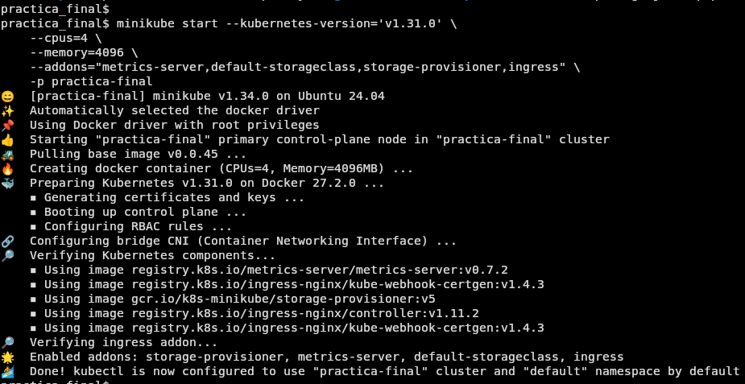

<p align="center"><a href="https://laravel.com" target="_blank"></a></p>


# README.md modificado
### Pasos a seguir para realizar los test
1. composer install
2. .cp .env.example .env
3. php artisan key:generate
4. php artisan test


### Pasos a seguir para migrar tablas a database refactorian

- `docker compose up -d --build`
- `docker compose exec phpmyadmin chmod 777 /sessions`
- `docker compose exec php bash`
- `chown -R www-data:www-data /var/www/storage /var/www/bootstrap/cache`
- `chmod -R 775 /var/www/storage /var/www/bootstrap/cache`
- `composer setup`
- `composer install`
- `php artisan key:generate`
- `php artisan migrate`


### Creación de los charts de Helm
Los charts de Helm tiene la siguiente estructura:
```
Helm Charts
  ├── templates/
  │   ├── _helpers.tpl           # Funciones y helpers reutilizables
  │   ├── adminer-deployment.yaml  # Deployment para Adminer
  │   ├── adminer-service.yaml     # Service para Adminer
  │   ├── db-statefulset.yaml      # statefulset para la base de datos
  │   ├── db-pvc.yaml              # Persistent Volume Claim para la base de datos
  │   ├── db-service.yaml          # Service para la base de datos
  │   ├── default-configmap.yaml   # ConfigMap por defecto
  │   ├── ingress.yaml             # Configuración de Ingress
  │   ├── myadmin-deployment.yaml  # Deployment para MyAdmin
  │   ├── myadmin-service.yaml     # Service para MyAdmin
  │   ├── nginx-configmap.yaml     # ConfigMap para NGINX
  │   ├── nginx-deployment.yaml    # Deployment para NGINX
  │   ├── nginx-service.yaml       # Service para NGINX
  │   ├── php-deployment.yaml      # Deployment para PHP
  │   ├── php-pvc.yaml             # Persistent Volume Claim para PHP
  │   ├── php-service.yaml         # Service para PHP
  │   ├── redis-deployment.yaml    # Deployment para Redis
  │   ├── redis-pvc.yaml           # Persistent Volume Claim para Redis
  │   ├── redis-service.yaml       # Service para Redis
  ├── .helmignore                  # Archivos ignorados por Helm
  ├── Chart.yaml                   # Metadatos del Helm Chart
  ├── values.yaml                  # Valores por defecto del Helm Chart
```    
#### PHP Deployment
Define un `Deployment` para un contenedor PHP, incluyendo la inicialización del entorno (mediante `initContainers`) y la ejecución del servicio principal en los `containers`.  
También se asegura de que los datos necesarios estén disponibles en un volumen persistente.  

- **initContainers**: Se utiliza un contenedor de inicialización para configurar el entorno antes de que se inicie el contenedor principal. A continuación se describe los comando principales:  
    - Esperar a que la base de datos este lista:
    ```
              echo "Esperar a que este lista la DDBB..." && \
          until mysqladmin ping -h {{ .Release.Name }}-db --silent; do
            sleep 2;
            echo "Esperando...";
          done;
    ```  
    - Copiar datos al volumen persistente Y confirmar que se copien:
    ```
              # Copiar los .env donde se encuentra la configuracion inicial
          if [ -f /var/www/.env ]; then
            cp /var/www/.env /mnt/www/.env;
            sed -i 's/^DB_HOST=.*/DB_HOST={{ .Release.Name }}-db/' /mnt/www/.env;
            echo "Actualizado DB_HOST en .env
          fi && \

          if [ -f /var/www/.env.example ]; then
            cp /var/www/.env.example /mnt/www/.env.example;
            sed -i 's/^DB_HOST=.*/DB_HOST={{ .Release.Name }}-db/' /mnt/www/.env;
            echo "Actualizado DB_HOST en .env.example""
          fi && \

          # Asegurarnos que los archivos estan presentes
          echo "Verificando contenido del volumen persistente..." && \
          ls -la /mnt/www && \
    ```  
    - Cambiar permisos:
    ```
          # Cambiar los permisos y propietarios
          echo "Cambiando permisos en el volumen persistente..." && \
          chown -R www-data:www-data /mnt/www && \
          chmod -R 775 /mnt/www && \
    ```  
- **containers**: Este es el contenedor principal que ejecuta PHP.  A continuación se describe los comando principales:  
    - Verificar existencia de `composer.json`
    ```
          # Comprobar que composer existe antes de continuar
          if [ ! -f /var/www/composer.json ]; then
            echo "composer.json not found in /var/www. Exiting.";
            exit 1; # Salir del script con un código de error
          fi;
    ```  
    - Cambiar permisos  
    ```
          # Cambiar los permisos y propietarios
          echo "Cambiando permisos en el volumen persistente..." && \
          chown -R www-data:www-data /var/www && \
          chmod -R 775 /var/www && \
    ```  
    - Instalar dependencias de Composer
    ```
          # Instalar las dependencias de composer
          echo "Instalando composer..." && \
          composer setup && \
    ```
    - Iniciar php-fpm: Arranca el servidor PHP-FPM, que manejará las solicitudes PHP
    ```
          php-fpm 
    ``` 
#### Base de datos
Para asegurar los datos de manera persitente se ha usado el manifiesto `persistentvolumeclaim`.
- **db-pvc**: Asegura los datos almacenados en la base de datos desde `db-staefulset.yaml`.
- **php-pvc**: Asegura los datos almacenados para los logs en `php-deployment.yaml`.

Para la base de datos se usa el manifiesto de `statefulset` puesto que están diseñados específicamente para aplicaciones con estado como bases de datos. Asegura que cada pod tenga un identificador único y un volumen persistente asociado.

El manifiesto es el siguiente:
```
apiVersion: v1
kind: PersistentVolumeClaim
metadata:
  name: {{ .Values.db.pvc.name }}
spec:
  accessModes:
  - ReadWriteOnce
  resources:
    requests:
      storage: {{ .Values.db.pvc.storage }}
```
Para el resto de `pvc` usados la estructura será la misma.  
Para gestionar este manifiesto, se debe modificar el manifiesto de `db-staefulset.yaml`.
```
      volumes:
      - name: {{ .Values.db.volumen.name }}
        persistentVolumeClaim:
          claimName: {{ .Values.db.pvc.name }}
```
#### Garantizar la resiliencia de la Aplicación
Para garantizar la resiliencia de la aplicación se hará uso de las `probes`: `LivenessProbe` y `readinessProbe`.

- **readinessProbe** se ha configurado en los siguientes manifiestos:
  - **db-statefulSet**: para comprobar que la dase de datos esta lista antes de aceptar conexiones:  
  ```
          # asegurarte de que solo esté marcado como listo cuando pueda aceptar conexiones
          readinessProbe:
            exec:
              command:
              - "/bin/sh"
              - "-c"
              - |
                mysqladmin ping -h localhost --silent
            initialDelaySeconds: {{ .Values.db.readiness.initialDelaySeconds }}
            periodSeconds: {{ .Values.db.readiness.periodSeconds }}
            timeoutSeconds: {{ .Values.db.readiness.timeoutSeconds }}
            successThreshold: {{ .Values.db.readiness.successThreshold }}
            failureThreshold: {{ .Values.db.readiness.failureThreshold }}
  ```  
  - **nginx-deployment**: para esperar a que la aplicación de `php` este lista: 
  ``` 
        # Esperar a que se despliegue el php antes de arrancar  
        readinessProbe:
          exec:
            command:
            - /bin/sh
            - -c
            - test -f /var/www/public/index.php
          initialDelaySeconds: {{ .Values.nginx.readiness.initialDelaySeconds }}
          periodSeconds: {{ .Values.nginx.readiness.periodSeconds }}
  ```  
  - **php-deployment**: necesario para usar `metrics` que será usado en el manifiesto de `HorizontalPodAutoscaler`.
  ```
        # php-fpm no está configurado para escuchar directamente en HTTP, se usa tcpSocket  
        readinessProbe:
          tcpSocket:
            port: {{ .Values.php.port }}
          initialDelaySeconds: {{ .Values.php.readiness.initialDelaySeconds }}
          periodSeconds: {{ .Values.php.readiness.periodSeconds }}  
  ```  
- **LivenessProbe** se ha configurado en los siguientes manifiestos:
  - **php-deployment**: necesario para usar `metrics` que será usado en el manifiesto de `HorizontalPodAutoscaler`.
  ```
        # php-fpm no está configurado para escuchar directamente en HTTP, se usa tcpSocket    
        livenessProbe:
          tcpSocket:
            port: {{ .Values.php.port }}
          initialDelaySeconds: {{ .Values.php.liveness.initialDelaySeconds }}
          periodSeconds: {{ .Values.php.liveness.periodSeconds }}
  ```

#### Escalar la Aplicación de manera automática
Para realizar la escabilidad se ha usado el manifiesto de `HorizontalPodAutoscaler`. Este manifiesto realizará un escalado horizontal.  
En este apartado se incluye el número minimo de replicas (2) para asegurar que la aplicación siempre esta disponible.  
```
apiVersion: autoscaling/v2
kind: HorizontalPodAutoscaler
metadata:
  name: "{{ .Release.Name }}-{{ .Values.php.name }}-{{ .Values.hpa.name }}" 
  namespace: default
spec:
  scaleTargetRef:
    apiVersion: apps/v1
    kind: Deployment
    name: "{{ .Release.Name }}-{{ .Values.php.name }}"  # El nombre del PHP deployment
  minReplicas: {{ .Values.hpa.minReplicas }}
  maxReplicas: {{ .Values.hpa.maxReplicas }}
  metrics:
  - type: Resource
    resource:
      name: {{ .Values.hpa.resource.name }}
      target:
        type: Utilization
        averageUtilization: {{ .Values.hpa.resource.utilization }}  # Escalar si el uso promedio de CPU supera el %
```  
Se ha incluido tambien en `php-deployment` unos requerimientos mínimos y máximos tanto de CPU como de memória.  
```
        resources:
          requests:
            cpu: {{ .Values.php.resources.requests.cpu }}       # CPU mínima solicitada
            memory: {{ .Values.php.resources.requests.memory }} # Memoria mínima solicitada
          limits:
            cpu: {{ .Values.php.resources.limits.cpu }}         # CPU máxima permitida
            memory: {{ .Values.php.resources.limits.memory }}   # Memoria máxima permitida
```
#### Exponer la Aplicación al exterior
Para poder exponer la aplicación al exterior se usará manifiesto del tipo Ingress el cual llamamos `ingress.yaml`.
La configuración es la siguiente:
```
spec:
  rules:
    - host: {{ .Values.ingress.host }}
      http:
        paths:
        # Añador los paths para los diferentes servicios
          - path: /
            pathType: Prefix
            backend:
              service:
                name: "{{ .Release.Name }}-{{ .Values.nginx.name }}"
                port:
                  number: {{ .Values.nginx.port }}
          - path: /phpmyadmin
            pathType: Prefix
            backend:
              service:
                name: "{{ .Release.Name }}-{{ .Values.phpmyadmin.name }}"
                port:
                  number: {{ .Values.phpmyadmin.port }}
          - path: /adminer
            pathType: Prefix
            backend:
              service:
                name: "{{ .Release.Name }}-{{ .Values.adminer.name }}"
                port:
                  number: {{ .Values.adminer.port }}
```
#### Comprobar despliegue
Para comprobar que se los charts de Helm se despliegan correctamente, ejecutamos los siguientes comandos:  
- Desplegar los charts: `helm upgrade --install my-app ./charts/`  
- Verificar el estado de los diferentes componentes desplegados:  
    - Verificar todos los estados: `kubectl get all`  
      
    - Verificar los `PVC`: `kubectl get pvc`  
    
    - Verificar autoescalado: `kubectl get hpa -w`  
    
    - Tambien lo podemos confirmar desde el dashboard de minikube:  
    

- Para verificar que `ingress` esté funcionando correctamente deberemos seguir los siguientes pasos:
  - Conocer la IP de minikube: 
    ```
    minikube -p practica-final ip
    ```   
  - Ejecutar:
    ```
    sudo nano /etc/host
    ```
    Colocamos el host del proyecto:  
    ```
    192.168.49.2 practica.local
    ``` 
  - En el navegador web, colocamos el siguiente enlace: http://practica.local
      
  - n el navegador web, colocamos el siguiente enlace: http://practica.local/adminer  
    

### Pasos a seguir para ArgoCD

1. Iniciar minikube
```bash
minikube start
```
2. Crear el namespace de ArgoCD si no existe
```bash
kubectl create namespace argocd
```
3. Si ArgoCD no está instalado en tu clúster de Kubernetes, instálalo ejecutando:

```bash
kubectl apply -n argocd -f https://raw.githubusercontent.com/argoproj/argo-cd/stable/manifests/install.yaml
```
4. Exponer el servidor de ArgoCD
Para acceder a la interfaz web de ArgoCD, realiza un port-forward al servicio del servidor de ArgoCD:
```bash
kubectl port-forward svc/argocd-server -n argocd 8080:443
```
Accede a la interfaz en https://localhost:8080.

5. Obtener las credenciales de acceso:
El usuario por defecto de ArgoCD es admin. Para obtener la contraseña, ejecuta el siguiente comando:
```bash
kubectl get secret argocd-initial-admin-secret -n argocd -o jsonpath="{.data.password}" | base64 -d
```
Copia la contraseña generada e inicia sesión en la interfaz web.

6. Crear la aplicación en ArgoCd

Aplica el archivo argoapp.yaml para registrar y desplegar la aplicación en ArgoCD:
```bash
kubectl apply -f practica_final/charts/argocd/argoapp.yaml
```


# Laravel Docker Starter Kit
- Laravel v11.x
- PHP v8.3.x
- MySQL v8.1.x (default)
- MariaDB v10.11.x
- PostgreSQL v16.x
- pgAdmin v4.x
- phpMyAdmin v5.x
- Mailpit v1.x
- Node.js v18.x
- NPM v10.x
- Yarn v1.x
- Vite v5.x
- Rector v1.x
- Redis v7.2.x

# Requirements
- Stable version of [Docker](https://docs.docker.com/engine/install/)
- Compatible version of [Docker Compose](https://docs.docker.com/compose/install/#install-compose)

# How To Deploy

### For first time only !
- `git clone https://github.com/refactorian/laravel-docker.git`
- `cd laravel-docker`
- `docker compose up -d --build`
- `docker compose exec phpmyadmin chmod 777 /sessions`
- `docker compose exec php bash`
- `chown -R www-data:www-data /var/www/storage /var/www/bootstrap/cache`
- `chmod -R 775 /var/www/storage /var/www/bootstrap/cache`
- `composer setup`

### From the second time onwards
- `docker compose up -d`

### Despliegue de Prometheus y Grafana
Para desplegar los ficheros en Prometheus se debe seguir los siguientes pasos:
- Crear un cluster de Kubernetes:  

    ```sh
    minikube start --kubernetes-version='v1.31.0' \
        --cpus=4 \
        --memory=4096 \
        --addons="metrics-server,default-storageclass,storage-provisioner,ingress" \
        -p practica-final
    ```  
    
- Añadir el repositorio de helm `prometheus-community` para poder desplegar el chart `kube-prometheus-stack`:

    ```sh
    helm repo add prometheus-community https://prometheus-community.github.io/helm-charts
    helm repo update
    ```  
 - Desplegar el chart `kube-prometheus-stack` del repositorio de helm añadido en el paso anterior con los valores configurados en el archivo `kube-prometheus-stack/values.yaml` en el namespace `monitoring`:

    ```sh
    helm -n monitoring upgrade \
        --install prometheus \
        prometheus-community/kube-prometheus-stack \
        -f kube-prometheus-stack/values.yaml \
        --create-namespace \
        --wait --version 55.4.0
    ```
    Para comprobar que se esta desplegando se deberá ejecutar el siguiente comando:

    ```sh
    kubectl --namespace monitoring get pods -l "release=prometheus"
    ```  
    

- Para poder acceder por el navegador web se deberá hacer un `port-forwarding` de los servicios, para ellos se deberá ejecutar los siguientes comandos:

  - Servicio de Grafana al puerto 3000 de la máquina:  

    ```sh
    kubectl -n monitoring port-forward svc/prometheus-grafana 3000:http-web
    ```  
    - Las credenciales por defecto son `admin` para el usuario y `prom-operator` para la contraseña.  

        

    - Acceder al dashboard creado para observar las peticiones al servidor a través de la URL `http://localhost:3000/   dashboards`, seleccionando una vez en ella la opción Import y en el siguiente paso seleccionar **Upload JSON File** y seleccionar el archivo presente en esta carpeta llamado `custom_dashboard.json`.

    

  - Servicio de Prometheus al puerto 9090 de la máquina:

    ```sh
    kubectl -n monitoring port-forward svc/prometheus-kube-prometheus-prometheus 9090:9090
    ```  

    - Para acceder a la aplicación web principal debemos hacerlo a través de la URL `http://localhost:9090`.  
    
    

#### Desinstalar recursos
Para desintalar los recursos una vez usados se deberá ejecutar los siguientes comandos:

- Eliminar el chart `kube-prometheus-stack` en el namespace `monitoring`:

  ```sh
  helm -n monitoring uninstall prometheus
  ```
- Eliminar el perfil `practica` de Minikube para detener y borrar los recursos de Kubernetes y el entorno en Minikube:

  ```sh
  minikube delete -p practica      
  ```  

# Notes

### Laravel Versions
- [Laravel 11.x](https://github.com/refactorian/laravel-docker/tree/main)
- [Laravel 10.x](https://github.com/refactorian/laravel-docker/tree/laravel_10x)

### Laravel App
- URL: http://localhost

### Mailpit
- URL: http://localhost:8025

### phpMyAdmin
- URL: http://localhost:8080
- Server: `db`
- Username: `refactorian`
- Password: `refactorian`
- Database: `refactorian`

### Adminer
- URL: http://localhost:9090
- Server: `db`
- Username: `refactorian`
- Password: `refactorian`
- Database: `refactorian`

### Basic docker compose commands
- Build or rebuild services
    - `docker compose build`
- Create and start containers
    - `docker compose up -d`
- Stop and remove containers, networks
    - `docker compose down`
- Stop all services
    - `docker compose stop`
- Restart service containers
    - `docker compose restart`
- Run a command inside a container
    - `docker compose exec [container] [command]`

### Useful Laravel Commands
- Display basic information about your application
    - `php artisan about`
- Remove the configuration cache file
    - `php artisan config:clear`
- Flush the application cache
    - `php artisan cache:clear`
- Clear all cached events and listeners
    - `php artisan event:clear`
- Delete all of the jobs from the specified queue
    - `php artisan queue:clear`
- Remove the route cache file
    - `php artisan route:clear`
- Clear all compiled view files
    - `php artisan view:clear`
- Remove the compiled class file
    - `php artisan clear-compiled`
- Remove the cached bootstrap files
    - `php artisan optimize:clear`
- Delete the cached mutex files created by scheduler
    - `php artisan schedule:clear-cache`
- Flush expired password reset tokens
    - `php artisan auth:clear-resets`

### Laravel Pint (Code Style Fixer | PHP-CS-Fixer)
- Format all files
    - `vendor/bin/pint`
- Format specific files or directories
    - `vendor/bin/pint app/Models`
    - `vendor/bin/pint app/Models/User.php`
- Format all files with preview
    - `vendor/bin/pint -v`
- Format uncommitted changes according to Git
    - `vendor/bin/pint --dirty`
- Inspect all files
  - `vendor/bin/pint --test`

### Rector
- Dry Run
    - `vendor/bin/rector process --dry-run`
- Process
    - `vendor/bin/rector process`
