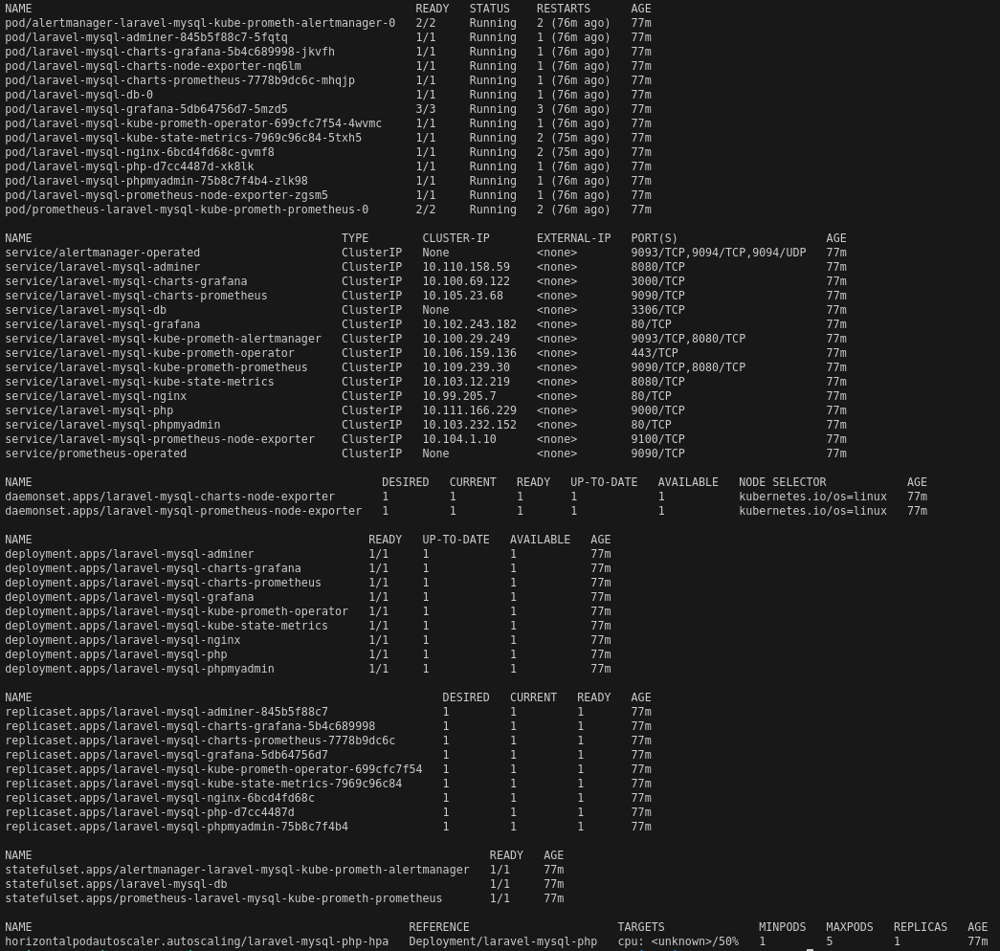
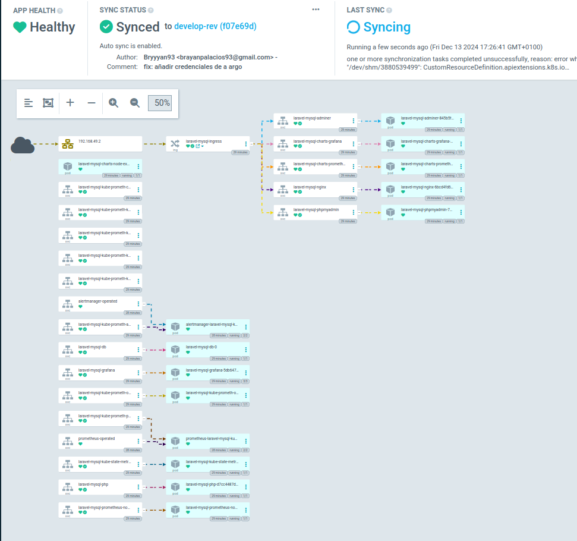
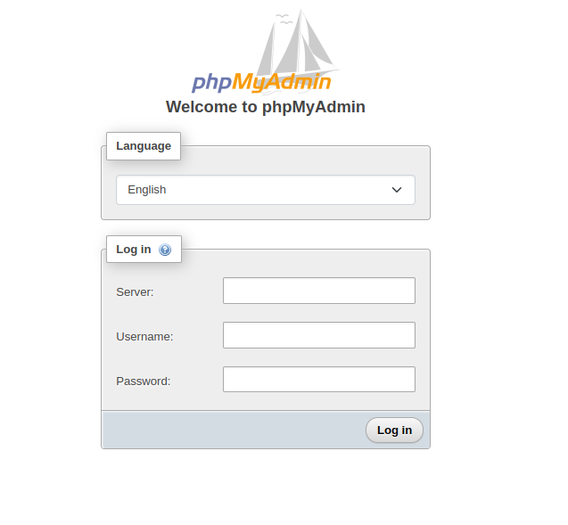
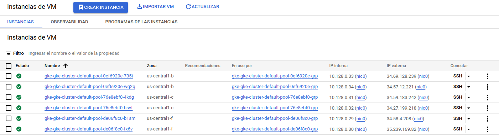
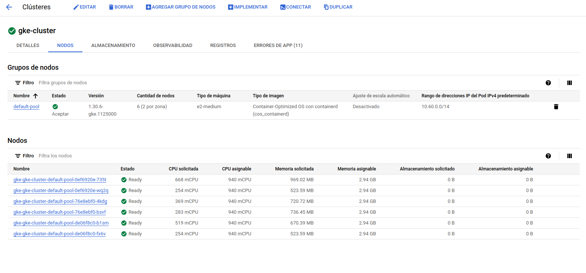
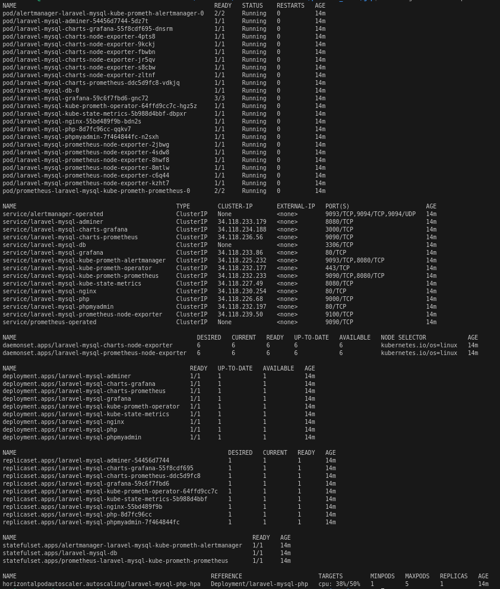
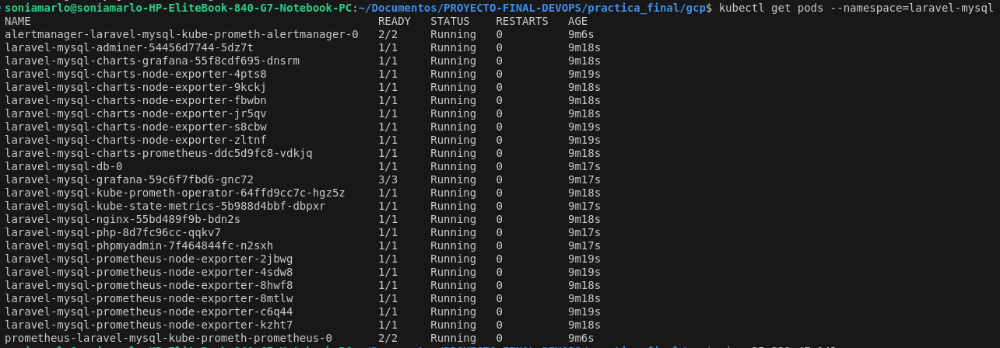

<p align="center"><a href="https://laravel.com" target="_blank"></a></p>

# Indice
- [Laravel Docker Starter Kit](#laravel-docker-starter-kit)
  - [Características Principales](#características-principales)
  - [Requisitos](#requisitos)
- [Despliegue](#despliegue)
  - [Primer despliegue](#primer-despliegue)
  - [A partir del segundo despliegue](#a-partir-del-segundo-despliegue)
- [Test de la aplicación](#test-de-la-aplicación)
- [Migración de la base de datos](#migración-de-la-base-de-datos)
- [Despliegue en Kubernetes](#despliegue-en-kubernetes)
  - [Arquitectura de Helm Chart](#arquitectura-de-helm-chart)
  - [Descripción de los componentes](#descripción-de-los-componentes)
    - [PHP Deployment](#php-deployment)
    - [Base de datos](#base-de-datos)
    - [Garantizar la resiliencia de la Aplicación](#garantizar-la-resiliencia-de-la-aplicación)
    - [Escalar la Aplicación de manera automática](#escalar-la-aplicación-de-manera-automática)
    - [Exponer la Aplicación al exterior](#exponer-la-aplicación-al-exterior)
    - [Gestión de Secrets](#gestión-de-secrets)
- [Monitorización con Prometheus y Grafana](#monitorización-con-prometheus-y-grafana)
  - [Manifiestos para Prometheus](#manifiestos-para-prometheus)
  - [Manifiestos para Grafana](#manifiestos-para-grafana)
  - [Importar Dashboard de Grafana](#importar-dashboard-de-grafana)
- [Despliegue con Helm](#despliegue-con-helm)
- [Despliegue con ArgoCD](#despliegue-con-argocd)
  - [Configuración del manifiesto](#configuración-del-manifiesto)
  - [Despliegue](#despliegue-1)
- [Despliegue de la monitorización](#despliegue-de-la-monitorización)
- [Workflows](#workflows)
  - [Test](#test)
  - [Release](#release)
- [Migración y despliegue en Google Cloud](#migración-y-despliegue-en-google-cloud)
  - [Estructura de archivos](#estructura-de-archivos)
  - [Guía de despliegue](#guía-de-despliegue)
  - [Limpieza de recursos](#limpieza-de-recursos)
- [Notes](#notes)
- [Posibles mejoras](#posibles-mejoras)
- [Referencias](#referencias)

# Laravel Docker Starter Kit
El Laravel Docker Starter Kit es una configuración preconstruida y optimizada que permite desplegar de manera rápida y eficiente un entorno de desarrollo completo para aplicaciones Laravel. Este kit proporciona las herramientas necesarias para trabajar con las versiones más recientes de Laravel, PHP, y tecnologías complementarias, utilizando Docker y Docker Compose.  

## Características Principales
- Framework: Laravel v11.x
- Backend: PHP v8.3.x
- Base de datos: MySQL v8.1.x (default)
- Administración de Base de Datos:
  - pgAdmin v4.x
  - phpMyAdmin v5.x
- Frontend:  
  - Node.js v18.x
  - NPM v10.x
  - Yarn v1.x
  - Vite v5.x
- Otras Herramientas  
  - Rector v1.x (para refactorización de código PHP)

## Requisitos
- Versión estable de Docker [Docker](https://docs.docker.com/engine/install/)
- Versión compatible de [Docker Compose](https://docs.docker.com/compose/install/#install-compose)

## Despliegue

### Primer despliegue
Para realizar el primer despliegue se deberá seguir los siguientes pasos:
- `git clone https://github.com/refactorian/laravel-docker.git`
- `cd laravel-docker`
- `docker compose up -d --build`
- `docker compose exec phpmyadmin chmod 777 /sessions`
- `docker compose exec php bash`
- `chown -R www-data:www-data /var/www/storage /var/www/bootstrap/cache`
- `chmod -R 775 /var/www/storage /var/www/bootstrap/cache`
- `composer setup`

### A partir del segundo despliegue
- `docker compose up -d`

## Test de la aplicación
Para realizar los test de la aplicación se deberá seguir los siguientes pasos:
- composer install
- .cp .env.example .env
- php artisan key:generate
- php artisan test


## Migración de la base de datos 
Para migrar tablas a database refactorian de deberá seguir los siguientes pasos:
- `docker compose up -d --build`
- `docker compose exec phpmyadmin chmod 777 /sessions`
- `docker compose exec php bash`
- `chown -R www-data:www-data /var/www/storage /var/www/bootstrap/cache`
- `chmod -R 775 /var/www/storage /var/www/bootstrap/cache`
- `composer setup`
- `composer install`
- `php artisan key:generate`
- `php artisan migrate`

<p align="center">
  
</p>

# Despliegue en Kubernetes

El despliegue anterior se puede extender utilizando `Helm Charts` para facilitar y automatizar el despliegue de la aplicación en entornos `Kubernetes`. Helm actúa como un gestor de paquetes para Kubernetes, permitiendo definir, instalar y actualizar configuraciones de aplicaciones complejas mediante archivos YAML reutilizables.  

## Arquitectura de Helm chart
La estructura del Helm Chart estaría organizada en los siguientes componentes:
```
charts/
├── argocd/                     # Subdirectorio para ArgoCD (si existe contenido)
├── charts/                     # Directorio principal de los charts
│   ├── templates/              # Manifiestos de Kubernetes parametrizados
│   │   ├── _helpers.tpl        # Funciones de ayuda reutilizables para nombres, etiquetas, etc.
│   │   ├── adminer-deployment.yaml    # Deployment para Adminer
│   │   ├── adminer-service.yaml       # Service para Adminer
│   │   ├── db-pvc.yaml                # Persistent Volume Claim para la base de datos
│   │   ├── db-secret.yaml             # Secret para credenciales de base de datos
│   │   ├── db-service.yaml            # Service para la base de datos
│   │   ├── db-StatefulSet.yaml        # StatefulSet para la base de datos (manejo de persistencia)
│   │   ├── default-configmap.yaml     # ConfigMap por defecto (variables globales)
│   │   ├── grafana-configmap.yaml     # Configuración para Grafana
│   │   ├── grafana-deployment.yaml    # Deployment para Grafana
│   │   ├── hpa.yaml                   # Horizontal Pod Autoscaler (HPA) para escalado automático
│   │   ├── ingress.yaml               # Reglas de Ingress para exponer servicios HTTP/HTTPS
│   │   ├── myadmin-deployment.yaml    # Deployment para MyAdmin
│   │   ├── myadmin-service.yaml       # Service para MyAdmin
│   │   ├── nginx-configmap.yaml       # Configuración para NGINX
│   │   ├── nginx-deployment.yaml      # Deployment para NGINX
│   │   ├── nginx-service.yaml         # Service para NGINX
│   │   ├── php-deployment.yaml        # Deployment para el contenedor PHP
│   │   ├── php-pvc.yaml               # Persistent Volume Claim para PHP
│   │   ├── php-service.yaml           # Service para PHP
│   │   ├── prometheus-configmap.yaml  # ConfigMap para Prometheus
│   │   ├── prometheus-deployment.yaml # Deployment para Prometheus
│   │   └── prometheus-node-exporter-daemonset.yaml  # DaemonSet para Node Exporter de Prometheus
│   ├── .helmignore             # Archivos ignorados por Helm
│   ├── Chart.yaml              # Metadatos del Helm Chart
│   ├── Chart.lock              # Archivo de bloqueo de dependencias
└── └── values.yaml             # Valores predeterminados configurables del Helm Chart
```    
## Descripción de los componentes
A continuación, se describe la configuración usada para los distintos manifiestos de Helm.  
    
### PHP Deployment
Define un `Deployment` para un contenedor PHP, incluyendo la inicialización del entorno (mediante `initContainers`) y la ejecución del servicio principal en los `containers`.  
También se asegura de que los datos necesarios estén disponibles en un volumen persistente.  

- **initContainers**: Se utiliza un contenedor de inicialización para configurar el entorno antes de que se inicie el contenedor principal. A continuación se describe los comando principales:  
    - Esperar a que la base de datos este lista:
    ```
              echo "Esperar a que este lista la DDBB..." && \
          until mysqladmin ping -h {{ .Release.Name }}-db --silent; do
            sleep 2;
            echo "Esperando...";
          done;
    ```  
    - Copiar datos al volumen persistente Y confirmar que se copien:
    ```
              # Copiar los .env donde se encuentra la configuracion inicial
          if [ -f /var/www/.env ]; then
            cp /var/www/.env /mnt/www/.env;
            sed -i 's/^DB_HOST=.*/DB_HOST={{ .Release.Name }}-db/' /mnt/www/.env;
            echo "Actualizado DB_HOST en .env
          fi && \

          if [ -f /var/www/.env.example ]; then
            cp /var/www/.env.example /mnt/www/.env.example;
            sed -i 's/^DB_HOST=.*/DB_HOST={{ .Release.Name }}-db/' /mnt/www/.env;
            echo "Actualizado DB_HOST en .env.example""
          fi && \

          # Asegurarnos que los archivos estan presentes
          echo "Verificando contenido del volumen persistente..." && \
          ls -la /mnt/www && \
    ```  
    - Cambiar permisos:
    ```
          # Cambiar los permisos y propietarios
          echo "Cambiando permisos en el volumen persistente..." && \
          chown -R www-data:www-data /mnt/www && \
          chmod -R 775 /mnt/www && \
    ```  
- **containers**: Este es el contenedor principal que ejecuta PHP.  A continuación se describe los comando principales:  
    - Verificar existencia de `composer.json`
    ```
          # Comprobar que composer existe antes de continuar
          if [ ! -f /var/www/composer.json ]; then
            echo "composer.json not found in /var/www. Exiting.";
            exit 1; # Salir del script con un código de error
          fi;
    ```  
    - Cambiar permisos  
    ```
          # Cambiar los permisos y propietarios
          echo "Cambiando permisos en el volumen persistente..." && \
          chown -R www-data:www-data /var/www && \
          chmod -R 775 /var/www && \
    ```  
    - Instalar dependencias de Composer
    ```
          # Instalar las dependencias de composer
          echo "Instalando composer..." && \
          composer setup && \
    ```
    - Iniciar php-fpm: Arranca el servidor PHP-FPM, que manejará las solicitudes PHP
    ```
          php-fpm 
    ``` 
### Base de datos
Para asegurar los datos de manera persitente se ha usado el manifiesto `persistentvolumeclaim`.
- **db-pvc**: Asegura los datos almacenados en la base de datos desde `db-staefulset.yaml`.
- **php-pvc**: Asegura los datos almacenados para los logs en `php-deployment.yaml`.

Para la base de datos se usa el manifiesto de `statefulset` puesto que están diseñados específicamente para aplicaciones con estado como bases de datos. Asegura que cada pod tenga un identificador único y un volumen persistente asociado.

El manifiesto es el siguiente:
```
apiVersion: v1
kind: PersistentVolumeClaim
metadata:
  name: {{ .Values.db.pvc.name }}
spec:
  accessModes:
  - ReadWriteOnce
  resources:
    requests:
      storage: {{ .Values.db.pvc.storage }}
```
Para el resto de `pvc` usados la estructura será la misma.  
Para gestionar este manifiesto, se debe modificar el manifiesto de `db-staefulset.yaml`.
```
      volumes:
      - name: {{ .Values.db.volumen.name }}
        persistentVolumeClaim:
          claimName: {{ .Values.db.pvc.name }}
```
### Garantizar la resiliencia de la Aplicación
Para garantizar la resiliencia de la aplicación se hará uso de las `probes`: `LivenessProbe` y `readinessProbe`.

- **readinessProbe** se ha configurado en los siguientes manifiestos:
  - **db-statefulSet**: para comprobar que la dase de datos esta lista antes de aceptar conexiones:  
  ```sh
          # asegurarte de que solo esté marcado como listo cuando pueda aceptar conexiones
          readinessProbe:
            exec:
              command:
              - "/bin/sh"
              - "-c"
              - |
                mysqladmin ping -h localhost --silent
            initialDelaySeconds: {{ .Values.db.readiness.initialDelaySeconds }}
            periodSeconds: {{ .Values.db.readiness.periodSeconds }}
            timeoutSeconds: {{ .Values.db.readiness.timeoutSeconds }}
            successThreshold: {{ .Values.db.readiness.successThreshold }}
            failureThreshold: {{ .Values.db.readiness.failureThreshold }}
  ```  
  - **nginx-deployment**: para esperar a que la aplicación de `php` este lista: 
  ```sh 
        # Esperar a que se despliegue el php antes de arrancar  
        readinessProbe:
          exec:
            command:
            - /bin/sh
            - -c
            - test -f /var/www/public/index.php
          initialDelaySeconds: {{ .Values.nginx.readiness.initialDelaySeconds }}
          periodSeconds: {{ .Values.nginx.readiness.periodSeconds }}
  ```  
  - **php-deployment**: necesario para usar `metrics` que será usado en el manifiesto de `HorizontalPodAutoscaler`.
  ```sh
        # php-fpm no está configurado para escuchar directamente en HTTP, se usa tcpSocket  
        readinessProbe:
          tcpSocket:
            port: {{ .Values.php.port }}
          initialDelaySeconds: {{ .Values.php.readiness.initialDelaySeconds }}
          periodSeconds: {{ .Values.php.readiness.periodSeconds }}  
  ```  
- **LivenessProbe** se ha configurado en los siguientes manifiestos:
  - **php-deployment**: necesario para usar `metrics` que será usado en el manifiesto de `HorizontalPodAutoscaler`.
  ```sh
        # php-fpm no está configurado para escuchar directamente en HTTP, se usa tcpSocket    
        livenessProbe:
          tcpSocket:
            port: {{ .Values.php.port }}
          initialDelaySeconds: {{ .Values.php.liveness.initialDelaySeconds }}
          periodSeconds: {{ .Values.php.liveness.periodSeconds }}
  ```

### Escalar la Aplicación de manera automática
Para realizar la escabilidad se ha usado el manifiesto de `HorizontalPodAutoscaler`. Este manifiesto realizará un escalado horizontal.  
En este apartado se incluye el número minimo de replicas (2) para asegurar que la aplicación siempre esta disponible.  
```sh
apiVersion: autoscaling/v2
kind: HorizontalPodAutoscaler
metadata:
  name: "{{ .Release.Name }}-{{ .Values.php.name }}-{{ .Values.hpa.name }}" 
  namespace: default
spec:
  scaleTargetRef:
    apiVersion: apps/v1
    kind: Deployment
    name: "{{ .Release.Name }}-{{ .Values.php.name }}"  # El nombre del PHP deployment
  minReplicas: {{ .Values.hpa.minReplicas }}
  maxReplicas: {{ .Values.hpa.maxReplicas }}
  metrics:
  - type: Resource
    resource:
      name: {{ .Values.hpa.resource.name }}
      target:
        type: Utilization
        averageUtilization: {{ .Values.hpa.resource.utilization }}  # Escalar si el uso promedio de CPU supera el %
```  
Se ha incluido tambien en `php-deployment` unos requerimientos mínimos y máximos tanto de CPU como de memória.  
```sh
        resources:
          requests:
            cpu: {{ .Values.php.resources.requests.cpu }}       # CPU mínima solicitada
            memory: {{ .Values.php.resources.requests.memory }} # Memoria mínima solicitada
          limits:
            cpu: {{ .Values.php.resources.limits.cpu }}         # CPU máxima permitida
            memory: {{ .Values.php.resources.limits.memory }}   # Memoria máxima permitida
```
### Exponer la Aplicación al exterior
Para poder exponer la aplicación al exterior se usará manifiesto del tipo Ingress el cual llamamos `ingress.yaml`.
La configuración es la siguiente:
```sh
spec:
  rules:
    - host: {{ .Values.ingress.host }}
      http:
        paths:
        # Añadir los paths para los diferentes servicios
          - path: /
            pathType: Prefix
            backend:
              service:
                name: "{{ .Release.Name }}-{{ .Values.nginx.name }}"
                port:
                  number: {{ .Values.nginx.port }}
          - path: /phpmyadmin
            pathType: Prefix
            backend:
              service:
                name: "{{ .Release.Name }}-{{ .Values.phpmyadmin.name }}"
                port:
                  number: {{ .Values.phpmyadmin.port }}
          - path: /adminer
            pathType: Prefix
            backend:
              service:
                name: "{{ .Release.Name }}-{{ .Values.adminer.name }}"
                port:
                  number: {{ .Values.adminer.port }}
```
### Gestión de Secrets
Para la gestión de secretos se ha implementado de la siguiente manera:  

- En el manifiesto `db-secret` se modifica el apartado de `data` para que reciba los valores y los codifique en `Base64`
  ```sh
  data:
  MYSQL_ROOT_PASSWORD: {{ .Values.db.credentials.rootPassword | b64enc | quote }} 
  MYSQL_DATABASE: {{ .Values.db.credentials.database | b64enc | quote }} 
  MYSQL_USER: {{ .Values.db.credentials.user | b64enc | quote }} 
  MYSQL_PASSWORD: {{ .Values.db.credentials.password | b64enc | quote }} 
  ```
- En el manifiesto `db.statefulset` se configura la adquisión de los valores: 
  ```sh
  env:
        - name: MYSQL_ROOT_PASSWORD
          valueFrom:
            secretKeyRef:
              name: "{{ .Release.Name }}-{{ .Values.db.name }}-{{ .Values.db.secrets.name }}"
              key: MYSQL_ROOT_PASSWORD
        - name: MYSQL_DATABASE
          valueFrom:
            secretKeyRef:
              name: "{{ .Release.Name }}-{{ .Values.db.name }}-{{ .Values.db.secrets.name }}"
              key: MYSQL_DATABASE
        - name: MYSQL_USER
          valueFrom:
            secretKeyRef:
              name: "{{ .Release.Name }}-{{ .Values.db.name }}-{{ .Values.db.secrets.name }}"
              key: MYSQL_USER
        - name: MYSQL_PASSWORD
          valueFrom:
            secretKeyRef:
              name: "{{ .Release.Name }}-{{ .Values.db.name }}-{{ .Values.db.secrets.name }}"
              key: MYSQL_PASSWORD
        volumeMounts:
        - name: {{ .Values.db.volumen.name }}
  ``` 
### Monitorización con Prometheus y Grafana

Para implementar la monitorización del clúster y de la aplicación, hemos utilizado Prometheus como herramienta de scraping de métricas y Grafana para la visualización de estas métricas. A continuación, se detalla cómo se han implementado y configurado ambos sistemas.

#### Manifiestos para Prometheus
- Despliegue de Prometheus: Se utiliza el manifiesto prometheus-deployment.yaml, que define un Deployment para Prometheus con una réplica y un volumen para la configuración.
```sh
    apiVersion: apps/v1
    kind: Deployment
    metadata:
      name: prometheus
      namespace: monitoring
    spec:
      replicas: 1
      template:
        spec:
          containers:
            - name: prometheus
              image: prom/prometheus:latest
              ports:
                - containerPort: 9090
              volumeMounts:
                - name: prometheus-config
                  mountPath: /etc/prometheus/prometheus.yml
                  subPath: prometheus.yml
```
- Configuración de Prometheus: Se usa el ConfigMap definido en el manifiesto prometheus-configmap.yaml para configurar los scrape_configs de Prometheus. Por ejemplo, en este caso, se recopilan métricas de node-exporter.
```sh 
  scrape_configs:
  - job_name: 'node-exporter'
    static_configs:
      - targets: ['laravel-mysql-charts-node-exporter.default.svc.cluster.local:9100']

```
- Exportador de métricas del nodo: Para recopilar métricas del sistema operativo, se implementa un DaemonSet con Node Exporter.
  ```sh
    apiVersion: apps/v1
  kind: DaemonSet
  metadata:
    name: node-exporter
    namespace: monitoring
  spec:
    template:
      spec:
        containers:
          - name: node-exporter
            image: quay.io/prometheus/node-exporter:v1.7.0
            ports:
              - containerPort: 9100
  ```
- Servicio de Prometheus: Para exponer Prometheus dentro del clúster, se utiliza un Service tipo ClusterIP.
  ```sh
  apiVersion: v1
  kind: Service
  metadata:
    name: prometheus
    namespace: monitoring
  spec:
    ports:
      - port: 9090
        targetPort: 9090
  ```
#### Manifiestos para Grafana
- El manifiesto grafana-deployment.yaml configura Grafana con un usuario y contraseña predeterminados, y un volumen que almacena la configuración del origen de datos.
  ```sh
  apiVersion: apps/v1
  kind: Deployment
  metadata:
    name: grafana
    namespace: monitoring
  spec:
    replicas: 1
    template:
      spec:
        containers:
          - name: grafana
            image: grafana/grafana:latest
            env:
              - name: GF_SECURITY_ADMIN_USER
                value: admin
              - name: GF_SECURITY_ADMIN_PASSWORD
                value: admin
            ports:
              - containerPort: 3000

  ```
- Configuración del origen de datos en Grafana: Se utiliza un ConfigMap llamado grafana-datasource.yaml que conecta Grafana con Prometheus como origen de datos.
  ```sh
  apiVersion: v1
  kind: ConfigMap
  metadata:
    name: grafana-datasource
    namespace: monitoring
  data:
    datasource.yml: |
      apiVersion: 1
      datasources:
        - name: Prometheus
          type: prometheus
          url: http://prometheus:9090
          access: proxy

  ```
- Servicio de Grafana: El manifiesto grafana-service.yaml expone Grafana dentro del clúster.
  ```sh
  apiVersion: v1
  kind: Service
  metadata:
    name: grafana
    namespace: monitoring
  spec:
    ports:
      - port: 3000
        targetPort: 3000

  ```
Con esta configuración, se obtiene monitorización en tiempo real de métricas críticas como uso de memoria, uso de CPU y peticiones realizadas por los pods. Este setup asegura una gestión eficiente del clúster y la aplicación, permitiendo un rápido diagnóstico en caso de problemas.  

## Despliegue con Helm
Para comprobar que se los charts de Helm se despliegan correctamente, ejecutamos los siguientes comandos:
- Crear un cluster de Kubernetes:  
    ```sh
    minikube start --kubernetes-version='v1.31.0' \
        --cpus=4 \
        --memory=4096 \
        --addons="metrics-server,default-storageclass,storage-provisioner,ingress" \
        -p practica-final
    ```
    <p align="center">
      
    </p>    

- Crear el namespace:
  ```sh 
  kubectl create namespace laravel-mysql
  ```
- Desplegar los charts: 
  ```sh
  helm upgrade --install my-app ./charts \
    --set db.credentials.rootPassword=root \
    --set db.credentials.database=refactorian \
    --set db.credentials.user=refactorian \
    --set db.credentials.password=refactorian \
    --namespace laravel-mysql
  ```  
- Verificar el estado de los diferentes componentes desplegados:  
    - Verificar todos los estados: `kubectl -n laravel-mysql get all`  
    <p align="center">
      
    </p>

    - Verificar los `PVC`: `kubectl -n laravel-mysql get pvc`  
    <p align="center">
      
    </p>

    - Verificar autoescalado: `kubectl -n laravel-mysql get hpa -w`  
    <p align="center">
      
    </p>

    - También lo podemos confirmar desde el dashboard de minikube:  
    <p align="center">
      
    </p>


- Para verificar que `ingress` esté funcionando correctamente deberemos seguir los siguientes pasos:
  - Conocer la IP de minikube: 
    ```sh
    minikube -p practica-final ip
    ```   
  - Ejecutar:
    ```sh
    sudo nano /etc/host
    ```
    Colocamos el host del proyecto:  
    ```sh
    192.168.49.2 practica.local
    ``` 
  - En el navegador web, colocamos el siguiente enlace: http://practica.local
    <p align="center">
      
    </p>  

  - En el navegador web, colocamos el siguiente enlace: http://practica.local/adminer  
    <p align="center">
      
    </p>  

## Despliegue con ArgoCD
ArgoCD es una herramienta declarativa de **Continuous Delivery (CD)** para Kubernetes que permite gestionar y automatizar el despliegue de aplicaciones mediante **GitOps**. Este flujo asegura que el estado deseado de las aplicaciones esté siempre sincronizado con las configuraciones definidas en un repositorio Git.

A continuación, se configurará y se desplegará `ArgoCD` en un clúster de Kubernetes local utilizando Minikube. Luego, registraremos una aplicación en `ArgoCD` para que sea gestionada y desplegada automáticamente.

### Configuración del manifiesto
El manifiesto creado para lanzar el despliegue de ArgoCD estará en la `charts/argocd/` y se llamará `argoapp.yaml`.  En este manifiesto se hará las siguientes modificaciones:

- Se deberá modificar el manifiesto de argocd para registrar la aplicación desde el repositorio.  
  ```
    project: default
    source:
      repoURL: 'https://github.com/Bryyyan93/practica_final.git'
      targetRevision: main # Se deplegará solo en la rama main
      path: charts
      helm:
        valueFiles:
          - values.yaml
  ```
- Añadir los parámetros con las credenciales para el despliegue de la base de datos:
  ```
      parameters:
        - name: db.credentials.rootPassword
          value: root
        - name: db.credentials.database
          value: refactorian
        - name: db.credentials.user
          value: refactorian
        - name: db.credentials.password
          value: refactorian
  ```  
### Despliegue
Para realizar el despliegue se deberá seguir los siguientes pasos:
- Iniciar el clúster de Kubernetes si no esta iniciado ya con los parámetros expuestos anteriormente.
```sh
  minikube start --kubernetes-version='v1.31.0' \
    --cpus=4 \
    --memory=4096 \
    --addons="metrics-server,default-storageclass,storage-provisioner,ingress" \
    -p practica-final
``` 
- Crear el namespace de ArgoCD si no existe
  ```sh
    kubectl create namespace argocd
  ```
- Si ArgoCD no está instalado en tu clúster de Kubernetes, instálalo ejecutando:
  ```sh
    kubectl apply -n argocd -f https://raw.githubusercontent.com/argoproj/argo-cd/stable/manifests/install.yaml
  ```
- Exponer el servidor de ArgoCD.  
  Para acceder a la interfaz web de ArgoCD, se realiza un port-forward al servicio del servidor de ArgoCD:
  ```sh
    kubectl port-forward svc/argocd-server -n argocd 8080:443
  ```
- Acceder a la interfaz en https://localhost:8080.

- Obtener las credenciales de acceso.
  El usuario por defecto de ArgoCD es admin. Para obtener la contraseña, ejecuta el siguiente comando:
  ```sh
    kubectl get secret argocd-initial-admin-secret -n argocd -o jsonpath="{.data.password}" | base64 -d
  ```
  Copiar la contraseña generada e inicia sesión en la interfaz web.

- Crear la aplicación en ArgoCD  
  Aplica el archivo argoapp.yaml para registrar y desplegar la aplicación en ArgoCD:
  ```sh
    kubectl apply -f practica_final/charts/argocd/argoapp.yaml
  ```  
<p align="center">
  
</p>

<p align="center">
  
</p>

## Despliegue de la monitorización
Para desplegar la monitorización de la aplicación con Helm y con ArgoCD de realizará de la misma manera:

- Acceso mediante Port-Forward.  
  Para acceder a phpMyAdmin, Prometheus y Grafana, es necesario realizar un port-forward desde la terminal.
    - Acceso a phpMyAdmin Ejecutar el siguiente comando en la terminal:
    ```sh
    kubectl port-forward svc/<nombre-svc-prometheus> -n <nombre-namespace> 8080:80
    ```
    Una vez ejecutado, abrir el navegador web y acceder a: http://localhost:8080

    <p align="center">
      
    </p>


- Acceso a Prometheus.  
  Realizar un port-forward para acceder a la interfaz.
  ```sh
  kubectl port-forward -n <nombre-namespace> svc/<nombre-svc-prometheus> 9090:9090
  ```
  Luego, acceder desde el navegador a: http://localhost:9090.

  <p align="center">
    
  </p>

  <p align="center">
    
  </p>

  <p align="center">
    
  </p>

  <p align="center">
    
  </p>

- Grafana.  
  Realizar un port-forward para acceder a la interfaz de Grafana.
  ```sh
  kubectl port-forward -n <nombre-namespace> <nombre-pod-grafana> 3000:3000
  ```
  Luego, acceder desde el navegador a: http://localhost:3000.
  
  <p align="center">
    
  </p>


### Importar Dashboard de Grafana

El dashboard personalizado se encuentra definido en el archivo custom_dashboard.json. Para importarlo:

1. Accede a Grafana en http://localhost:3000.
2. Inicia sesión con las credenciales:
Usuario: admin
Contraseña: prom-operator
3. Dirígete a la sección de Dashboards.
4. Selecciona la opción "Import".
5. Sube el archivo  [json de grafana ](grafana/custom_dashboard.json)
6. Guarda y visualiza el dashboard.  

# Workflows
Para realizar los workflows se hecho uso de `GitHub Actions` ya que permite definir workflows que automatizan tareas repetitivas, como la ejecución de pruebas y la generación de releases, a través de archivos YAML almacenados en el directorio `.github/workflows`.  

En este caso, los workflows tiene la siguiente estructura:
```sh
.github/
└── workflows/
    ├── release.yml    # Workflow para realizar releases automáticas
    └── test.yml       # Workflow para ejecutar pruebas automatizadas
```

## Test
Este workflow automatiza las pruebas y el análisis de calidad de código en una aplicación PHP usando GitHub Actions. A continuación se destacan los puntos más importantes:  

- **Trigger**: Se ejecuta en push o pull request.
```sh
on:
  push:
    branches: [ "*" ]
  pull_request:
    branches: [ "*" ]
```
- **Instalación de PHP y dependencias**: Se usa Composer y se cachean las dependencias.
  ```sh
  - name: Cache Composer Dependencies
    uses: actions/cache@v3
    with:
      path: vendor
      key: composer-${{ hashFiles('**/composer.lock') }}
      restore-keys: |
        composer-

  ```  
  Cachea las dependencias de Composer para acelerar la instalación en ejecuciones futuras.
- **Pruebas automatizadas**: Se ejecutan pruebas con PHPUnit.
  ```sh
  - name: Execute tests (Unit and Feature tests) via PHPUnit
    env:
      DB_CONNECTION: sqlite
      DB_DATABASE: database/database.sqlite
    run: vendor/bin/phpunit

  ```  
  Ademas se genera un reporte de cobertura.
  ```sh
  - name: Generate coverage report
    env:
      DB_CONNECTION: sqlite
      DB_DATABASE: database/database.sqlite
    run: vendor/bin/phpunit --coverage-clover=coverage.xml
  ```

- **Subida de resultados**: Los reportes de cobertura se guardan como artefactos.
  ```sh
  - name: Upload Test Results
    uses: actions/upload-artifact@v3
    with:
      name: test-results
      path: coverage.xml
  ```
- **Análisis de calidad**: SonarCloud valida la calidad del código y la cobertura de pruebas.
  ```sh
  - name: Run SonarScanner
    uses: SonarSource/sonarqube-scan-action@v4
    env:
      SONAR_TOKEN: ${{ secrets.SONAR_TOKEN }}
    with:
      args: >
        -Dsonar.host.url=https://sonarcloud.io
        -Dsonar.organization=${{ secrets.SONAR_ORGANIZATION }}
        -Dsonar.projectKey=${{ secrets.SONAR_PROJECT_KEY}}
        -Dsonar.php.coverage.reportPaths=coverage.xml
  ```
<p align="center">
  
</p>  

## Release
Este workflow automatiza la generación de releases, la construcción de imágenes Docker multiplataforma y el empaquetado de Helm Charts tras la ejecución exitosa del workflow "test" en la rama `main`.

- **Trigger**: Se ejecuta automáticamente cuando el workflow `test` en la rama `main` finaliza con éxito.
- **Releases**: Genera versiones automáticas usando semantic-release. 
  ```sh
  - name: Release
    run: |
      npx semantic-release --debug | tee semantic_release_output.txt
      if grep -q "There are no relevant changes" semantic_release_output.txt; then
        VERSION=$(git describe --tags --abbrev=0)
      else
        VERSION=$(grep -oP '(?<=Published release ).*' semantic_release_output.txt)
        echo "$VERSION" > semantic_release_version.txt
      fi
  ```
  <p align="center">
    
  </p>
- **Docker**:
  - Construcción de imágenes multiplataforma con QEMU y Buildx.
    ```sh
    - uses: docker/build-push-action@v6
      with:
      context: .
      platforms: linux/amd64,linux/arm64
      push: true
      tags: ${{ steps.meta.outputs.tags }}
      labels: ${{ steps.meta.outputs.labels }}
    ```
  - Publicación en GHCR y Docker Hub.
    <p align="center">
      
    </p>

    <p align="center">
      
    </p>

- **Helm**: Actualización y empaquetado de Helm Charts para versiones consistentes.
  ```sh
  - name: Update helm chart files to latest version
    run: |
      IMAGE_NAME="ghcr.io/${{ github.repository }}" yq -i '.image.repository = strenv(IMAGE_NAME)' ./charts/values.yaml

  ```
- **Caché de herramientas**: Optimiza la instalación de yq, helm-docs y dependencias npm.

  <p align="center">
    
  </p>

  <p align="center">
    
  </p>


# Migración y despliegue en Google Cloud

Este proyecto contiene los archivos necesarios para desplegar una infraestructura en Google Cloud Platform (GCP), utilizando **Terraform** para la creación de un clúster de Kubernetes (GKE), una base de datos gestionada (Cloud SQL), y el despliegue de la aplicación Laravel con Helm Charts.

## Estructura de archivos 

```

gcp/
├── gke-cluster.tf             # Configuración del clúster de Kubernetes (GKE) en GCP
├── helm-release.tf            # Configuración para desplegar Helm Charts en el clúster GKE
├── providers.tf               # Configuración de proveedores (Google Cloud y Helm)
└── variables.tf               # Variables globales
```
## Guía de despliegue

**Requisitos previos**
- Cuenta activa en Google Cloud Plattform(GCP)
- Instalación de:
  · Terraform
- Configuración del acceso a GCP con gcloud CLI:

```
gcloud auth application-default login
gcloud config set project <ID_PROYECTO>
```

**Pasos para desplegar**

- Configurar variables.
  Edita el archivo variables.tf o usa un archivo terraform.tfvars para ajustar las variables del proyecto. Ejemplo:

  ```sh
  project = "mi-proyecto-gcp"
  region  = "europe-west3"
  cluster_name = "laravel-mysql-cluster"
  ```
- Inicializar Terraform. Ejecutar los siguientes comandos en la carpeta terraform/:
  ```sh
  terraform init
  ```
- Aplicar la configuración. Crear y desplegar los recursos en GCP:

  ```sh
  terraform apply
  ```
  Confirmar la ejecución escribiendo `yes` cuando se solicite.

- Configurar el Clúster GKE. Obtener las credenciales del clúster GKE y configúralas en kubectl:
  ```sh
  gcloud container clusters get-credentials laravel-mysql-cluster --region us-central1
  ```
Verificamos que los recursos se hayan desplegado correctamente.
- En la consola de GCP  
  <p align="center">
    
  </p>
  Comprobamos que se creen las instancias.  
  <p align="center">
    
  </p>
  Comprobamos que se creen los nodos.  
  <p align="center">
    
  </p>

- Usando los comandos de `kubectl`, comprobamos que se hayan desplegado los recursos  
  <p align="center">
    
  </p>
  Verificamos los pods.  
  <p align="center">
    
  </p>


## Limpieza de recursos

Para eliminar todos los recursos creados, ejecuta:
```sh
terraform destroy
```
Confirma escribiendo yes cuando se solicite.

# Notes
- Laravel Versions
  - [Laravel 11.x](https://github.com/refactorian/laravel-docker/tree/main)
  - [Laravel 10.x](https://github.com/refactorian/laravel-docker/tree/laravel_10x)
- Laravel App
  - URL: http://localhost
- phpMyAdmin
  - **URL**: http://localhost:8080
  - **Server**: `db`
  - **Username**: `refactorian`
  - **Password**: `refactorian`
  - **Database**: `refactorian`
- Adminer
  - **URL**: http://localhost:9090
  - **Server**: `db`
  - **Username**: `refactorian`
  - **Password**: `refactorian`
  - **Database**: `refactorian`
- Basic Docker Compose Commands
  - **Build or rebuild services**  
    - `docker compose build`
  - **Create and start containers**  
    - `docker compose up -d`
  - **Stop and remove containers, networks**  
    - `docker compose down`
  - **Stop all services**  
    - `docker compose stop`
  - **Restart service containers**  
    - `docker compose restart`
  - **Run a command inside a container**  
    - `docker compose exec [container] [command]`
- Useful Laravel Commands
  - **Display basic information about your application**  
    - `php artisan about`
  - **Remove the configuration cache file**  
    - `php artisan config:clear`
  - **Flush the application cache**  
    - `php artisan cache:clear`
  - **Clear all cached events and listeners**  
    - `php artisan event:clear`
  - **Delete all of the jobs from the specified queue**  
    - `php artisan queue:clear`
  - **Remove the route cache file**  
    - `php artisan route:clear`
  - **Clear all compiled view files**  
    - `php artisan view:clear`
  - **Remove the compiled class file**  
    - `php artisan clear-compiled`
  - **Remove the cached bootstrap files**  
    - `php artisan optimize:clear`
  - **Delete the cached mutex files created by scheduler**  
    - `php artisan schedule:clear-cache`
  - **Flush expired password reset tokens**  
    - `php artisan auth:clear-resets`
- Laravel Pint (Code Style Fixer | PHP-CS-Fixer)
  - **Format all files**  
    - `vendor/bin/pint`
  - **Format specific files or directories**  
    - `vendor/bin/pint app/Models`  
    - `vendor/bin/pint app/Models/User.php`
  - **Format all files with preview**  
    - `vendor/bin/pint -v`
  - **Format uncommitted changes according to Git**  
    - `vendor/bin/pint --dirty`
  - **Inspect all files**  
    - `vendor/bin/pint --test`
- Rector
  - **Dry Run**  
    - `vendor/bin/rector process --dry-run`
  - **Process**  
    - `vendor/bin/rector process`
# Posibles mejoras
- **Evitar port-forward**.Se ha hecho pruebas para poder acceder a los servicios de phpmydmin, Grafana y Prometheus através del manifiesto de `ingress`. Por falta de tiempo, no se ha podido investigar el por que no se ha conseguido acceder a estos servicios.

Para el caso concreto de phpmyadmin, falla al cargar los estáticos de la página web. Para un futuro nos gustaría que todos los servicios sean accesibles atraves del ingress.

  - **Manejo de los secretos**. Dado que no es muy seguro mantener los secretos directamente en el repositorio se ha implementado `Sealed Secrets`. Es una solución de Bitnami que permite cifrar secretos con una clave pública del clúster. Los secretos cifrados se almacenan en el repositorio y se descifran en el clúster.  

  Para implementar se sigue los siguientes pasos:  

  - Instalar el controlador de `Sealed Secrets` en el clúster.
    ```sh
    kubectl apply -f https://github.com/bitnami-labs/sealed-secrets/releases/download/v0.20.5/controller.yaml
    ```  
    - Verifica que el controller esté en funcionamiento:
      ```
      kubectl get pods -n kube-system | grep sealed-secrets

      ```  
  - Instalar la CLI de Sealed Secrets (`kubeseal`)
    ```sh
    KUBESEAL_VERSION='0.25.0'
    curl -OL "https://github.com/bitnami-labs/sealed-secrets/releases/download/v${KUBESEAL_VERSION:?}/kubeseal-${KUBESEAL_VERSION:?}-linux-amd64.tar.gz"
    tar -xvzf kubeseal-${KUBESEAL_VERSION:?}-linux-amd64.tar.gz kubeseal
    sudo install -m 755 kubeseal /usr/local/bin/kubeseal
    ```
    - Verifica que esté instalado correctamente:  
      ```sh
      kubeseal --version

      ```  
  - Crear un archivo de secretos no cifrado, como este:
    ```sh
    apiVersion: v1
    kind: Secret
    metadata:
    name: my-db-secret
    namespace: default
    data:
    MYSQL_ROOT_PASSWORD: bXktc2VjcmV0LXJvb3Q=  # Base64 de "my-secret-root"
    MYSQL_DATABASE: bXktZGF0YWJhc2U=           # Base64 de "my-database"
    MYSQL_USER: bXktdXNlcg==                   # Base64 de "my-user"
    MYSQL_PASSWORD: bXktcGFzc3dvcmQ=           # Base64 de "my-password"
    ```      
  - Cifrar el archivo usando Sealed Secrets
    ```sh
    kubeseal --controller-namespace kube-system --controller-name sealed-secrets-controller \  
      --format yaml < db-secret.yaml > db-sealed-secrets.yaml

    ```
  - Se obtiene un manifiesto que, despues de parametrizar, obtenemos:
    ```sh
        ---
        apiVersion: bitnami.com/v1alpha1
        kind: SealedSecret
        metadata:
          creationTimestamp: null
          name: db-secret  #"{{ .Release.Name }}-{{ .Values.db.name }}-{{ .Values.db.secrets.name }}"
          namespace: default
          labels:
            app: {{ .Values.db.name }}
            app.kubernetes.io/managed-by: Helm
          annotations:
            "helm.sh/hook": "pre-install, pre-upgrade"
            "helm.sh/hook-weight": "-1"
            meta.helm.sh/release-name: {{ .Release.Name }}
            meta.helm.sh/release-namespace: {{ .Release.Namespace }}  
        spec:
          encryptedData:
          # Datos encriptados  
          template:
            metadata:
              creationTimestamp: null
              labels:
                app: {{ .Values.db.name }}
                app.kubernetes.io/managed-by: Helm
              name: db-secret  #"{{ .Release.Name }}-{{ .Values.db.name }}-{{ .Values.db.secrets.name }}"
              namespace: {{ .Release.Namespace }}
              annotations:
                "helm.sh/hook": "pre-install, pre-upgrade"
                "helm.sh/hook-weight": "-1"
                meta.helm.sh/release-name: {{ .Release.Name }}
                meta.helm.sh/release-namespace: {{ .Release.Namespace }}

            type: Opaque
    ``` 
  Al desplegar con `ArgoCD` hubo algunos problemas la momento de desencriptar las credenciales por lo que se optó por una solución más sencilla, descrita anteriormente.

- **Modificaciones dinamicas**. En este punto nos gustaría que se le pueda dar valores para crear y desplegar la aplicación con credenciales distintas a las de por defecto, al momento de ejecutar. Los valores que nos gustaría que fueran dinámicos son:
  - Credenciales de la Base de datos. 
  - Configuraciones de los .env
  - Configuraciones del dashboard de Grafana.

# Referencias
Para el desarrollo de este proyecto se ha hecho uso de la siguiente documentación:
- Aplicación base: https://github.com/refactorian/laravel-docker
- https://github.com/learnk8s/laravel-kubernetes-demo.git
- https://medium.com/@Ahmed75/deploy-laravel-application-on-kubernetes-best-practice-ce52af341df
- https://www.digitalocean.com/community/tutorials/how-to-deploy-laravel-7-and-mysql-on-kubernetes-using-helm
- Apuntes de los distintos modulos del bootcamp 

